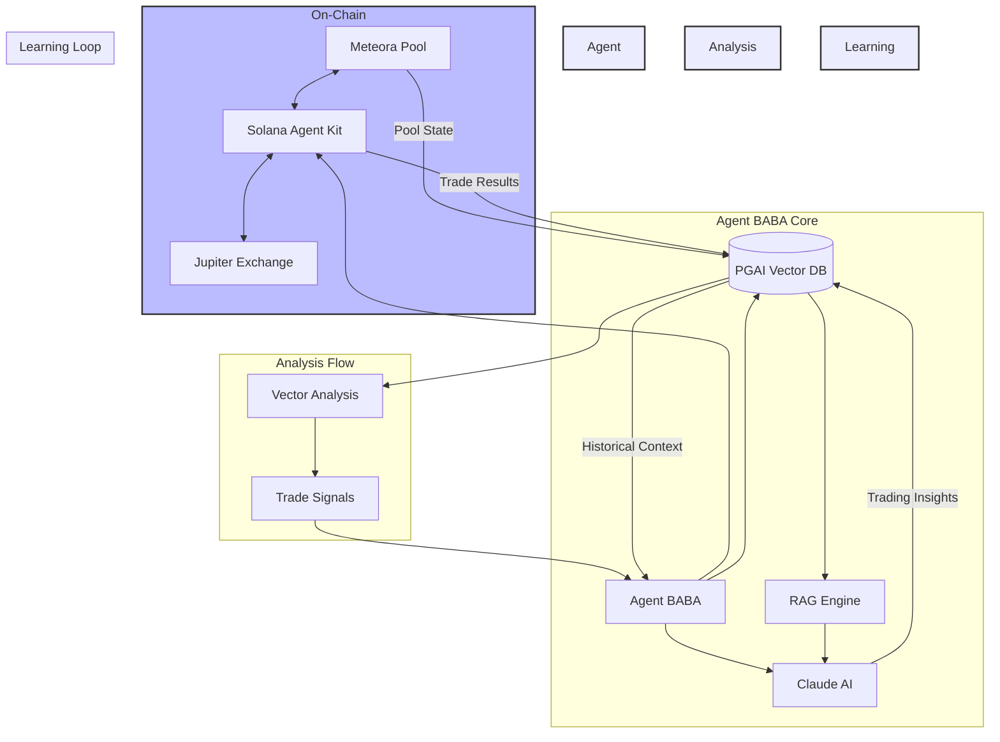

<p align="center">
  
</p>

## Agent BABA: Autonomous Solana Trading Agent with RAG-Enhanced Decision Making

[](https://opensource.org/licenses/MIT)
[](https://bun.sh/)
[](https://solana.com/)

### 🌟 Overview

Agent BABA is an innovative autonomous trading agent that operates on the Solana blockchain, specifically designed to optimize trading strategies for the $BABABILL token through Meteora liquidity pools. By combining the power of Retrieval Augmented Generation (RAG), pgAI vector embeddings, and autonomous decision-making capabilities, Agent BABA represents a new paradigent in on-chain trading automation.

### 🏗️ Architecture



### 🚀 Key Features

#### 1. Autonomous Trading

- Real-time monitoring of Meteora pools
- Automated micro-trading strategies
- Self-adjusting parameters based on market conditions
- Slippage protection and fail-safes

#### 2. RAG-Enhanced Decision Making

- Vector embeddings of historical trades
- Semantic search for similar market conditions
- AI-powered strategy optimization
- Continuous learning from trade outcomes

#### 3. Advanced Analytics

- Real-time price impact analysis
- Liquidity depth monitoring
- Performance tracking and optimization
- Historical trade pattern analysis

### 🛠️ Technical Stack

- **Blockchain**: Solana
- **DEX Integration**: Meteora/Jupiter
- **Language**: TypeScript/Bun
- **AI**: Claude AI (Anthropic)
- **Vector Database**: PGAI
- **Server**: Hono
- **SDK**: Solana Agent Kit

### 📊 Data Flow

1. **Market Monitoring**

   - Continuous monitoring of Meteora pool states
   - Real-time price and liquidity tracking
   - Transaction monitoring and analysis

2. **Trade Analysis**

   - Vector embedding of trade parameters
   - Semantic similarity search for historical context
   - AI-powered outcome prediction
   - Risk assessment and optimization

3. **Execution**
   - Smart order routing via Jupiter
   - Slippage protection
   - Transaction verification
   - Performance recording

### 💡 Innovation Highlights

- **First RAG-Enhanced Solana Trading Agent**: Combines on-chain data with AI-powered decision making
- **Autonomous Learning Loop**: Continuously improves trading strategies based on outcomes
- **Vector-Based Market Analysis**: Uses cutting-edge vector similarity for market pattern recognition
- **Micro-Trading Optimization**: Specialized in small, efficient trades for optimal returns

### 🔧 Installation

```bash
# Clone the repository
git clone https://github.com/yourusername/agent-baba.git

# Install dependencies
bun install

# Initialize the database
bun run init-db

# Start the agent
bun run dev
```

### 🌐 API Endpoints

- `GET /health` - Check agent status
- `GET /price` - Get current BABABILL price
- `GET /estimate-trade` - Estimate trade outcome

### 🔒 Environment Variables

```env
HELIUS_RPC_URL=your_helius_url
CLAUDE_API_KEY=your_claude_key
POSTGRES_HOST=localhost
POSTGRES_PORT=5432
POSTGRES_DB=agent_baba
POSTGRES_USER=postgres
POSTGRES_PASSWORD=postgres
```

### 👥 Team

Built with 💜 by Team BABABILL for the Solana AI Agent Hackathon

### 📄 License

MIT License - see LICENSE for details
