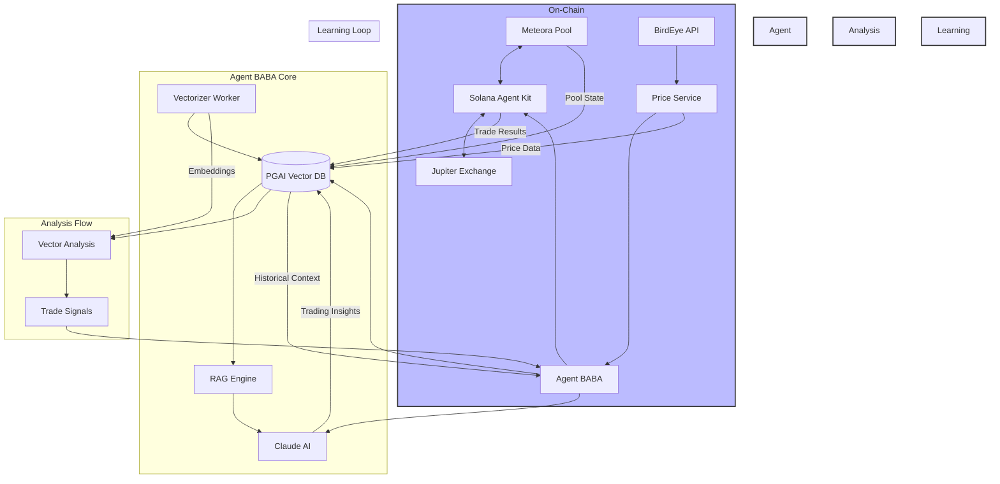

<p align="center">
  
</p>

## Agent BABA: Autonomous Solana Trading Agent with RAG-Enhanced Decision Making

[](https://opensource.org/licenses/MIT)
[](https://bun.sh/)
[](https://solana.com/)

### 🌟 Overview

Agent BABA is an innovative autonomous trading agent that operates on the Solana blockchain, specifically designed to optimize trading strategies for the $BABABILL token through Meteora liquidity pools. By combining the power of Retrieval Augmented Generation (RAG), pgAI vector embeddings, and autonomous decision-making capabilities, Agent BABA represents a new paradigm in on-chain trading automation.

### 🏗️ Architecture



### 🚀 Key Features

1. **Autonomous Trading**

   - Real-time monitoring of Meteora pools
   - Automated micro-trading strategies
   - Self-adjusting parameters based on market conditions
   - Slippage protection and fail-safes
   - Integrated BirdEye price feeds

2. **RAG-Enhanced Decision Making**

   - Vector embeddings of historical trades using pgAI
   - Semantic search with Ollama (all-minilm model)
   - Automated vector updates via pgAI vectorizer
   - Continuous learning from trade outcomes

3. **Advanced Analytics**
   - Real-time price impact analysis via BirdEye
   - Liquidity depth monitoring
   - Vector-based trade pattern analysis
   - Historical trade pattern matching

### 📚 Usage Examples

1. **Basic Agent Initialization**

```typescript
import { AgentBABA } from './services/agent';

// Initialize with default configuration
const agent = new AgentBABA();

// Check agent health
const health = await agent.getAgentHealth();
console.log('Agent Status:', health.status);
console.log('Warnings:', health.warnings);
```

2. **Paper Trading**

```typescript
// Initialize paper trading portfolio
const portfolioId = await agent.initializePaperTrading();

// Execute a buy trade (0.1 SOL worth)
const buyTrade = await agent.executePaperTrade('BUY', 0.1);
console.log('Buy Trade Result:', {
  amountIn: buyTrade.amountIn,
  amountOut: buyTrade.amountOut,
  priceImpact: buyTrade.estimatedPriceImpact,
  fee: buyTrade.feesSol,
});

// Get portfolio status
const status = await agent.getPaperPortfolioStatus();
console.log('Portfolio Balance:', {
  SOL: status.portfolio.currentBalanceSol,
  BABABILL: status.portfolio.currentBalanceBababill,
});
```

3. **Vector-Enhanced Trade Analysis**

```typescript
// Search for similar historical trades
const similarTrades = await agent.tradeVectorizer.searchSimilarTrades(
  'profitable trades with low price impact',
  5 // limit
);

// Analyze trade patterns
const tradeAnalysis = await agent.tradeVectorizer.findSimilarTradesWithContext(
  'successful trading patterns in current market conditions'
);
console.log('AI Analysis:', tradeAnalysis);
```

4. **Token Operations**

```typescript
// Deploy BABA token
const tokenDeploy = await agent.deployBABAToken();
console.log('Token Mint:', tokenDeploy.mint.toString());

// Create NFT collection
const collection = await agent.deployBABACollection();
console.log('Collection:', collection.collectionAddress.toString());

// Send BABA airdrop
const recipients = [
  'AH7F2EPqGPvHmCwKxghfpjpYKGX4zHxiEiKQCUAk65zj',
  'BH8F3EPqGPvHmCwKxghfpjpYKGX4zHxiEiKQCUAk65zk',
];
const airdropResult = await agent.sendBABABAirdrop(recipients, 100);
console.log('Airdrop Signatures:', airdropResult);
```

### 🛠️ Technical Stack

- **Blockchain:** Solana
- **DEX Integration:** Meteora/Jupiter
- **Language:** TypeScript/Bun
- **AI:** Claude AI (Anthropic)
- **Vector Database:** PGAI with Ollama
- **Price Oracle:** BirdEye API
- **Server:** Hono
- **SDK:** Solana Agent Kit

### 🔧 Installation

```bash
# Clone the repository
git clone https://github.com/yourusername/agent-baba.git

# Install dependencies
bun install

# Start the database and required services
docker compose up -d

# Pull required Ollama model
docker compose exec ollama ollama pull all-minilm

# Initialize the database
bun run init-db

# Start the agent
bun run dev
```

### 🌐 API Endpoints

```bash
# Check agent health
curl http://localhost:3000/health

# Get current BABABILL price
curl http://localhost:3000/price

# Initialize paper trading
curl -X POST http://localhost:3000/paper-trading/initialize

# Execute a paper trade
curl -X POST http://localhost:3000/paper-trading/trade \
  -H "Content-Type: application/json" \
  -d '{"tradeType": "BUY", "amountIn": 0.1}'

# Get trading history
curl http://localhost:3000/paper-trading/trades?limit=10&offset=0

# Get portfolio analytics
curl http://localhost:3000/paper-trading/analytics
```

### 🔒 Environment Variables

```env
HELIUS_RPC_URL=your_helius_url
CLAUDE_API_KEY=your_claude_key
BIRDEYE_API_KEY=your_birdeye_key
POSTGRES_HOST=localhost
POSTGRES_PORT=5432
POSTGRES_DB=agent_baba
POSTGRES_USER=postgres
POSTGRES_PASSWORD=postgres
```

### 📦 Docker Services

```yaml
services:
  db:
    image: timescale/timescaledb-ha:pg17
  vectorizer-worker:
    image: timescale/pgai-vectorizer-worker:latest
  ollama:
    image: ollama/ollama
```

### 🧪 Testing

```bash
# Run basic tests
bun test

# Test paper trading
bun run test-paper-trade

# Test price service
bun run test-price-service

# Test vectorizer
bun run test-vectorizer
```

### 🚀 Production Deployment

For production deployment, consider:

- Setting up proper monitoring
- Configuring fail-safes
- Setting up backup systems
- Implementing circuit breakers
- Using secure key management

### 👥 Team

Built with 💜 by Team BABABILL for the Solana AI Agent Hackathon

### 📄 License

MIT License - see LICENSE for details

### 🤝 Contributing

Contributions are welcome! Please read our Contributing Guidelines for details on our code of conduct and the process for submitting pull requests.

### 📞 Support

Join our Discord for support and discussions.

```

```
