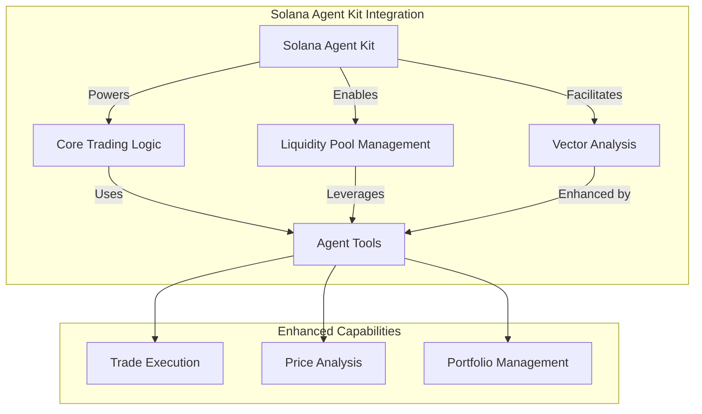
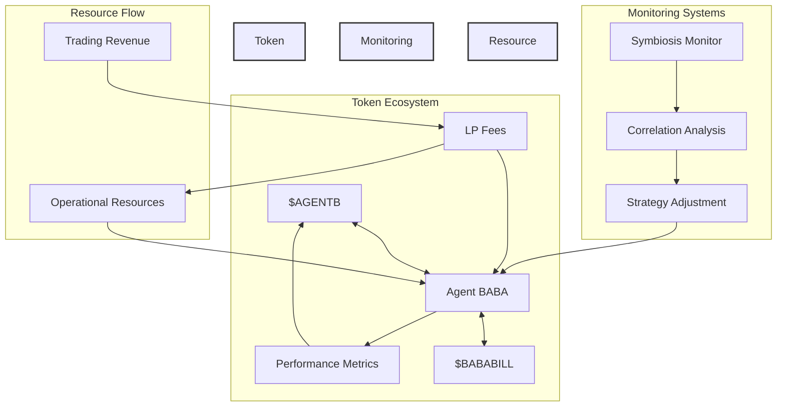

<p align="center">

</p>

## Agent BABA: Autonomous Solana Trading Agent with Vector-Enhanced Analysis and Token Symbiosis

[](https://opensource.org/licenses/MIT)
[](https://bun.sh/)
[](https://solana.com/)
[](https://anchor-lang.com/)
[](https://meteora.ag/)

### 🌟 Overview

Agent BABA represents a breakthrough in autonomous trading agents on Solana, introducing the first self-sustaining AI trading system powered by innovative token symbiosis. Built on the Solana Agent Kit, it showcases how AI agents can leverage Solana's high-performance infrastructure for sophisticated trading operations. By combining Meteora liquidity pools, vector-based trade analysis, and a unique dual-token economic model ($AGENTB and $BABABILL), Agent BABA creates a self-reinforcing ecosystem where AI performance directly correlates with token value.

### 🛠️ Solana Agent Kit Integration

Agent BABA demonstrates advanced integration of the Solana Agent Kit, showcasing its versatility and power:



#### Advanced Integration Features

1. **Custom Tool Extension**

   ```typescript
   // Extended Solana Agent Kit with custom symbiosis tools
   class SymbiosisMonitorTool extends Tool {
     name = 'monitor_symbiosis';
     description = 'Monitors token correlation and health';

     async _call(input: string): Promise<string> {
       const metrics = await symbiosisService.getPerformanceMetrics();
       return JSON.stringify({
         correlation: metrics.correlation,
         healthStatus: metrics.healthStatus,
       });
     }
   }
   ```

2. **Integrated Vector Analysis**

   ```typescript
   // Using Solana Agent Kit for vector-enhanced trading
   const tools = createSolanaTools(agent);
   tools.push(new VectorAnalysisTool(agent));
   ```

3. **Enhanced Trading Capabilities**
   - Leverages kit's built-in Meteora integration
   - Extended with custom symbiosis monitoring
   - Automated parameter optimization

Agent BABA represents a breakthrough in autonomous trading agents on Solana, introducing the first self-sustaining AI trading system powered by innovative token symbiosis. By combining Meteora liquidity pools, vector-based trade analysis, and a unique dual-token economic model ($AGENTB and $BABABILL), Agent BABA creates a self-reinforcing ecosystem where AI performance directly correlates with token value.

### 🔄 Token Symbiosis Innovation

The cornerstone of Agent BABA's innovation is its groundbreaking symbiotic relationship between $AGENTB and $BABABILL tokens, establishing a first-of-its-kind self-sustaining AI trading ecosystem on Solana.

#### Symbiotic Architecture



#### Key Innovation Points

1. **Economic Alignment Mechanism**

   - Direct correlation between AI performance and token value
   - Market-driven performance metrics
   - Automatic rebalancing based on symbiosis health

   ```typescript
   // Real-time symbiosis monitoring
   async monitorSymbiosis() {
     const metrics = await getPerformanceMetrics();
     if (metrics.correlation < CONFIG.SYMBIOSIS.MIN_CORRELATION) {
       await this.adjustTradingParameters('conservative');
     }
     return metrics;
   }
   ```

2. **Self-Sustaining Operations**

   - Liquidity pool fees fund ongoing development
   - Performance-based resource allocation
   - Automated treasury management

   ```typescript
   // Resource allocation based on performance
   const performanceMetrics = {
     correlation: 0.85, // Token price correlation
     efficiency: 0.92, // Trading efficiency
     sustainability: 0.88, // Resource utilization
   };
   ```

3. **Advanced Monitoring Systems**

   ```typescript
   // Symbiosis health monitoring
   interface SymbiosisHealth {
     correlation: number; // Token correlation strength
     tradingEfficiency: number; // Trading performance
     resourceUtilization: number; // Resource usage efficiency
   }
   ```

4. **Adaptive Trading Parameters**
   - Real-time strategy adjustments
   - Risk management based on symbiosis health
   - Performance-driven parameter optimization

### 🏗️ Core Architecture

[Original architecture diagram remains the same]

### 💡 Innovation Highlights

1. **First Self-Sustaining AI Trading Agent**

   - Autonomous resource generation and allocation
   - Market-driven performance validation
   - Self-optimizing trading strategies

2. **Vector-Enhanced Trade Analysis**

   - Claude AI powered trade vectorization
   - Pattern recognition and strategy adaptation
   - Historical performance analysis

3. **Symbiotic Token Economics**

   - Dual-token model for aligned incentives
   - Automated value correlation maintenance
   - Self-adjusting trading parameters

4. **Comprehensive Monitoring System**
   ```sql
   -- Symbiosis monitoring table
   CREATE TABLE token_correlations (
       id SERIAL PRIMARY KEY,
       bababill_price NUMERIC NOT NULL,
       agentb_price NUMERIC NOT NULL,
       correlation_coefficient NUMERIC NOT NULL,
       timestamp TIMESTAMPTZ DEFAULT CURRENT_TIMESTAMP
   );
   ```

### 🔬 Performance Metrics

Agent BABA provides comprehensive performance tracking:

1. **Token Correlation Strength**

   - Real-time correlation monitoring
   - Automatic strategy adjustment thresholds
   - Historical correlation analysis

2. **Trading Efficiency**

   - Success rate tracking
   - Price impact analysis
   - Fee optimization metrics

3. **Resource Utilization**
   - LP fee collection rates
   - Operational cost analysis
   - Resource allocation efficiency

### 📊 Symbiosis Dashboard

```typescript
// Example symbiosis metrics endpoint
app.get('/symbiosis/metrics', async (c) => {
  const metrics = await agentBABA.monitorSymbiosis();
  return c.json({
    correlation: metrics.correlation,
    tradingEfficiency: metrics.efficiency,
    healthStatus: metrics.correlation > 0.7 ? 'healthy' : 'needs attention',
    timestamp: new Date().toISOString(),
  });
});
```

### 🎯 Future Development

1. **Enhanced Symbiosis Mechanisms**

   - Multi-token correlation analysis
   - Advanced resource allocation algorithms
   - Expanded performance metrics

2. **AI Strategy Optimization**

   - Deep learning for pattern recognition
   - Predictive analytics integration
   - Advanced risk management systems

3. **Ecosystem Expansion**
   - Integration with additional DEXes
   - Cross-chain symbiosis monitoring
   - Advanced treasury management

### 👥 Team

Built with 💜 by Team BABABILL for the Solana AI Agent Hackathon 2024

### 📄 License

MIT License - see LICENSE for details

### 🤝 Contributing

Contributions welcome! Please read our Contributing Guidelines before submitting pull requests.
