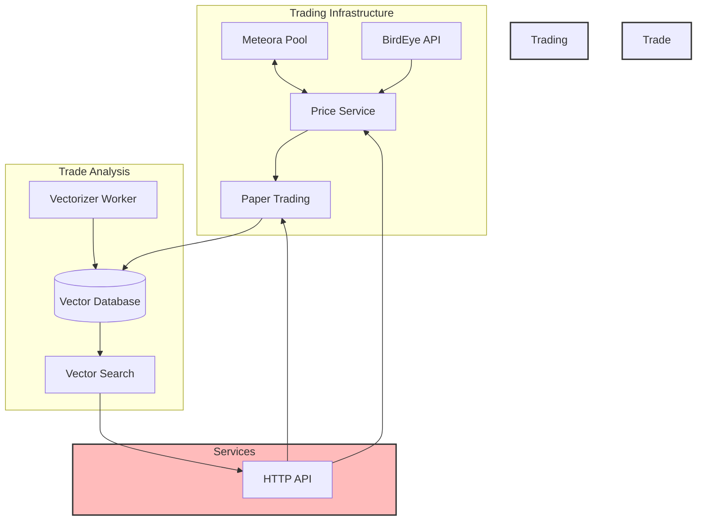

markdownCopy<p align="center">


</p>

## Agent BABA: Autonomous Solana Trading Agent with Vector-Enhanced Analysis

[](https://opensource.org/licenses/MIT)
[](https://bun.sh/)
[](https://solana.com/)

### 🌟 Overview

Agent BABA is an autonomous trading agent for the Solana blockchain that combines Meteora liquidity pools, vector-based trade analysis, and paper trading capabilities. It uses pgvector for trade pattern analysis and provides a comprehensive API for interacting with Meteora pools, analyzing trades, and managing paper trading portfolios.

### 🏗️ Core Architecture



### 🚀 Key Features

**Meteora Pool Integration**

- Real-time pool state monitoring
- Price impact analysis
- Liquidity validation
- Pool health checks

**Paper Trading System**

- Portfolio management
- Trade execution simulation
- Performance tracking
- Historical trade analysis

**Price Services**

- BirdEye price feed integration
- Aggregated price service with fallbacks
- Historical price tracking
- Price impact estimation

**Vector-Based Analysis**

- Trade vectorization using Claude AI
- Semantic similarity search
- Pattern recognition
- Automated vector updates

### 💾 Database Schema

```sql
-- Core Tables
paper_portfolios        # Paper trading portfolios
paper_trades           # Individual trade records
trade_embeddings_store # Vector embeddings for trades
meteora_pool_states    # Pool state snapshots
portfolio_snapshots    # Portfolio value snapshots
```

### 📚 Usage Examples

**Initialize Paper Trading**

```typescript
import { agentBABA } from './services/agent';

// Create new paper trading portfolio
const portfolioId = await agentBABA.initializePaperTrading();
console.log('Portfolio created:', portfolioId);

// Check portfolio status
const status = await agentBABA.getPaperPortfolioStatus();
console.log('Balance:', {
  SOL: status.portfolio.currentBalanceSol,
  BABABILL: status.portfolio.currentBalanceBababill,
});
```

**Execute Paper Trades**

```typescript
// Execute a buy trade
const buyTrade = await agentBABA.executePaperTrade('BUY', 0.1);
console.log('Trade Result:', {
  amountIn: buyTrade.amountIn,
  amountOut: buyTrade.amountOut,
  priceImpact: buyTrade.estimatedPriceImpact,
  fee: buyTrade.feesSol,
});

// Get trade history
const trades = await agentBABA.getPaperTrades(10);
console.log('Recent Trades:', trades);
```

Price Analysis

```typescript
// Check current price
const price = await agentBABA.checkBABABILLPrice();

// Estimate trade impact
const estimate = await agentBABA.estimateMicroTrade(0.1);
console.log('Trade Estimate:', {
  expectedOutput: estimate.estimatedAmountOut,
  priceImpact: estimate.priceImpact,
  fee: estimate.fee,
});
```

### 🛠️ Technical Stack

Blockchain: Solana
DEX: Meteora Pools
Database: PostgreSQL + pgvector
Language: TypeScript/Bun
Price Oracle: BirdEye
Server: Hono
Vector Analysis: Claude AI embeddings

````

### 🔧 Installation

```bash
# Clone the repository
git clone https://github.com/yourusername/agent-baba.git

# Install dependencies

bun install

# Start services

docker compose up -d

# Initialize database

bun run init-db

# Start agent

bun run dev
````

### 🌐 API Endpoints

```bash
# System Health
GET /health

# Price Information

GET /price
GET /estimate-trade

# Paper Trading

POST /paper-trading/initialize
GET /paper-trading/status
POST /paper-trading/trade
GET /paper-trading/trades
```

### 🔒 Environment Setup

```env
# RPC and APIs
HELIUS_RPC_URL=your_helius_url
CLAUDE_API_KEY=your_claude_key
BIRDEYE_API_KEY=your_birdeye_key

# Database

POSTGRES_HOST=localhost
POSTGRES_PORT=5432
POSTGRES_DB=agent_baba
POSTGRES_USER=postgres
POSTGRES_PASSWORD=postgres
```

### 📦 Docker Services

```yaml
services:
db:
image: timescale/timescaledb-ha:pg17
environment:
POSTGRES_PASSWORD: postgres
ports: - "5432:5432"
volumes: - data:/home/postgres/pgdata/data - ./src/db:/docker-entrypoint-initdb.d

vectorizer-worker:
image: timescale/pgai-vectorizer-worker:latest
environment:
PGAI_VECTORIZER_WORKER_DB_URL: postgres://postgres:postgres@db:5432/postgres
```

### 🧪 Testing

```bash
# Test suites
bun test # Run all tests
bun run test-paper-trade # Test paper trading
bun run test-price-service # Test price services
bun run test-vectorizer # Test vector analysis
```

### 👥 Team

Built with 💜 by Team BABABILL for the Solana AI Agent Hackathon

### 📄 License

MIT License - see LICENSE for details

### 🤝 Contributing

Contributions welcome! Please read our Contributing Guidelines before submitting pull requests.

```

```
